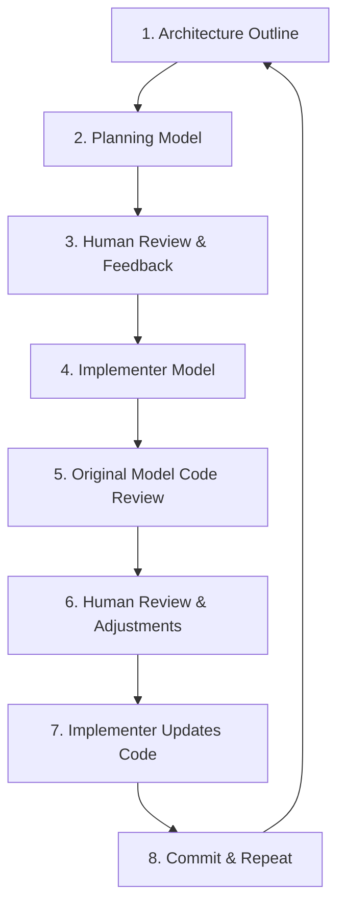

# Evolution of a Movie Library App

## Origin and Philosophy

When deciding to build a cataloging application for my movie library, the motivation was rooted in a personal problem. As my physical collection has grown and I've added in digital items, keeping track of exactly what I own, and in which format (physical Blu-ray vs. digital 4K UHD), has become cumbersome. I wanted a simple, single source of truth to manage my library and help me decide what to watch.

Rather than adapting an existing service, I chose to build this application from the ground up to tailor the UX to my exact preferences. The initial design, prototyped in Adobe XD, was centered around four core pillars:
1. **Search and Catalog:** Quickly look up titles via the TMDB API and add them to a personal collection.
2. **Multi-dimensional Sorting:** Order the collection by title, release date, date added, or genre.
3. **Library Search:** Instantly query within a user's library.
4. **Randomizer:** Randomly select a movie from the library to solve decision fatigue.

---

## From Expo React Native to Next.js PWA

The first iteration of this project was built as a native mobile application using React Native and the Expo ecosystem. Expo allowed for rapid initial prototyping and platform-agnostic development. However, as the project matured, two critical friction points emerged:
- **Distribution Constraints:** Apple’s App Store policies made sharing or viewing the app publicly via Expo Go difficult without maintaining paid developer accounts and going through formal app store distribution pipelines.
- **Platform Limitations:** While mobile access is critical for checking a physical library on the go, I found myself wanting to access the library on different devices.

To achieve a true "installable" native mobile feel alongside a web-friendly desktop experience, I chose to refactor the application into a **Progressive Web App (PWA)** built on **Next.js**. Next.js was chosen because it allowed me to consolidate the frontend and backend into a single framework while still supporting the app-like experience I wanted from a PWA.

### Modern Web Architecture
By moving to Next.js, the architecture evolved from a mobile client to a cohesive, type-safe full-stack application:
- **Framework & Logic:** Next.js Server Actions handle data mutations, while Server Components enforce secure, database-level operations in pages.
- **Database & Deduplication:** MongoDB was chosen in the initial iteration of the project to gain familiarity with a database that was used in a common web stack (MERN). I decided to use it again to reuse the existing model structure and database operations. Additionally, I found that MongoDB natively supported vector indexing and search, which I was interested in using for an AI recommendation system. While the schema I designed is relational, MongoDB met the technical needs of the application and avoided taking on the overhead of switching to a new solution. The data model consists of a `User` document that links to user-specific entries (`UserMovie` and `UserWishlist`), which in turn reference a shared `Movie` details collection. This ensures that even if multiple users add *The Matrix*, movie metadata is stored only once.
- **PWA Service Worker:** A custom service worker (`public/sw.js`) handles asset pre-caching and offline page fallback.
- **Offline Data Sync:** Client-side caching utilizes **Dexie** (a wrapper around IndexedDB). When a connection is lost, mutations are recorded in an IndexedDB sync queue. Once network connectivity is restored, a component sends the requests sequentially via Server Actions.

---

## Exploring Agentic Coding

Beyond rebuilding the application, a secondary goal was to experiment with **agentic coding**. Could I develop a quality application using agents? To find out, I utilized Gemini and Claude models in Google's Antigravity IDE. I still wanted to maintain ultimate authority over the output and decisions, so I operated Antigravity in "sandbox" mode, requiring it to request permission for each change. To structure the development process, I designed a strict multi-model development loop:

1. **Architecture Outline:** I began by planning out and defining the core functionality of the application, data schemas, and tech stack.
2. **Implementation Plan:** A primary LLM model was tasked with writing a detailed, step-by-step implementation plan based on my outline.
3. **Plan Review:** I reviewed this plan, adjusted boundaries, asked clarifying questions, and finalized the design.
4. **Active Implementation:** A *secondary model* was used to write the code. Using a different model for implementation was intended to reduce confirmation bias. The secondary model was forced to evaluate the code objectively, rather than relying on its own assumptions while generating the plan or biases inherited from its training.
5. **Verification & Review:** The original planning model was brought back to conduct a code review of the newly implemented code. This routinely brought up areas where the generated code was inefficient or incorrect.
6. **Final Human Polish:** I reviewed the changes, requested modifications or refactoring where necessary, and had the implementer model finalize the edits.
7. **Commit & Iterate:** Once verified, the changes were committed, and the loop began again for the next feature.

### Specialized Agent Skills
To ensure the AI agents produced secure, quality code, I configured specialized **agent skills and rules** that acted as guardrails for:
* **Framework Best Practices:** Enforcing clean React Server Component boundaries, proper handling of asynchronous APIs, and Next.js route conventions.
* **OWASP Security Standards:** Ensuring strict input validation (via Zod), preventing rate-limiting vulnerabilities, protecting API routes, and validating user access permissions.
* **Code Review & Quality:** Spotting anti-patterns, redundant queries, and ensuring proper error handling.
* **Testing Guidelines:** Standardizing Jest unit tests and Cypress end-to-end integration tests to verify critical flows.

---

## AI Recommendations

An additional area I wanted to focus on during this migration was an **AI Recommendation System**. I wanted a solution that incorporated artificial intelligence without intense implementation work or inference costs. The result is a system that blends content similarity with collaborative signals and can be run locally on my hardware.

### 1. Content-Based Similarity Search
For each movie added to the global catalog, a semantic textual description is generated from the title, genres, TMDB keywords, director, cast, and plot synopsis. This text is passed to an offline embedding model (`sentence-transformers`) to generate a vector that is stored on the `Movie` document. Cosine similarity is used via MongoDB's **Atlas Vector Search** to find semantic neighbors directly within the database.

### 2. Preserving User Taste
In researching how I wanted to implement this feature, I found that a common issue in recommendation engines is generating a single user profile vector by averaging the vectors of the movies they like. If a user enjoys dark sci-fi thrillers and lighthearted family comedies, averaging their vectors results in a middle-ground that doesn't capture their actual tastes.

To preserve the variance that occurs in user preference, the app:
* Samples up to 3 highly-rated or recently added movies from the user's library independently.
* Runs a separate vector similarity search for each of the sample movies.
* Interleaves the resulting recommendations in a round-robin style (filtering out already-owned films) to present a highly targeted selection.

### 3. Collaborative Filtering (Future Enhancement)
This is a feature that I'm considering adding in the future. It would add another layer to the recommendation system, finding movies not based solely on content, but on other users' behavior. One possibility I've started exploring is using the **MovieLens 25M dataset** with the following approach:
* Compute item-to-item similarity scores offline, mapping what movies are frequently rated highly by the same users.
* Save these to a collection in MongoDB.
* At runtime, these collaborative candidates are merged with the content-based vector search results.
* A blending algorithm dynamically weights these two tracks: libraries with fewer than 15 movies lean heavily on collaborative ratings to help with the "cold start" problem, while larger libraries balance content-based vectors to provide highly specific recommendations.
* Finally, a **genre diversity pass** groups recommendation candidates and caps any single genre at 40% of the final list to prevent clustering.

## Takeaways
Overall, I found this project to be rewarding and informative. The app functions well and has provided me with immediate utility. Additionally, I was able to spend significant time understanding the strengths and limitations of agentic coding tools. A few of my thoughts on AI-assisted coding:
* Helpful in brainstorming solutions to features or problems a developer has identified
* Great at reviewing human-written code to identify inefficiencies, vulnerabilities, and bugs
* The speed of development comes at a cost:
    * The mental model of how the application fits together can be muddied or lost
    * Review fatigue can lead to accepting changes without full understanding
* While the agents were generally successful in completing tasks, more than once they would go down rabbit holes, burning through my tokens with no result
* Additionally, agents made poor architectural decisions, wrote insecure code, and missed implementation details on numerous occasions. This cemented the need for specialized skills and other guardrails, such as multi-model development.

I believe there are great benefits in AI-assisted coding. However, I'm wary of having agents be the primary developer of software. To me, AI works better as a reviewer and brainstorming partner, ensuring the owners of the code have full understanding of how it functions, why architecture decisions were made and the tradeoffs involved.